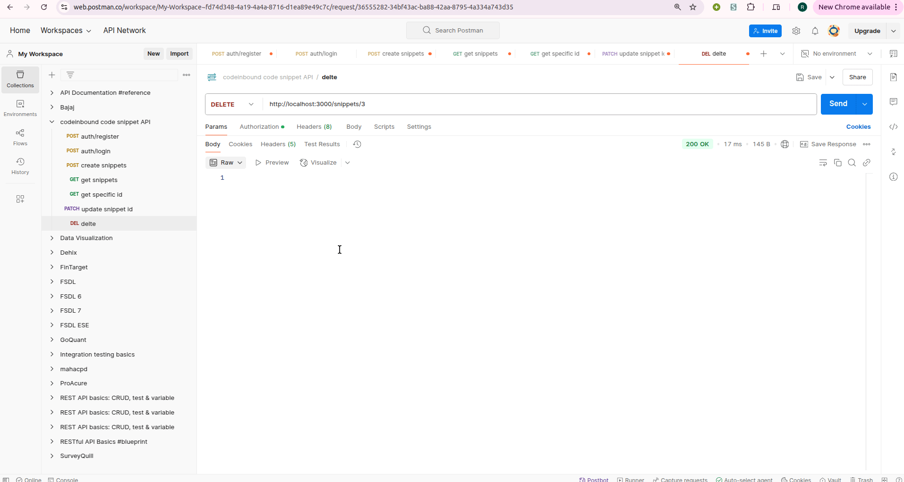

## Task List

- [x] Set up Nest.js project
- [x] Implement user authentication
- [x] Create CRUD operations for snippets
- [x] Implement tagging system
- [x] Set up PostgreSQL with TypeORM
- [x] Implement JWT authentication
- [x] Implement Swagger documentation
- [ ] Write unit tests
- [ ] Create README


# Code Snippet API

This is a Nest.js-based API for managing code snippets. It allows users to create, read, update, and delete code snippets

## Features

- User authentication (JWT)
- CRUD operations for code snippets
- Tagging system for snippets
- PostgreSQL database integration using TypeORM

## Prerequisites

- Node.js (v14 or later)
- npm (v6 or later)
- PostgreSQL

## Installation

1. Clone the repository:
`git clone https://github.com/RudradevArya/codeinbound-OA.git`
`cd codeinbound-OA`

2. Install dependencies:
`npm install`

3. Set up environment variables:
   Create a `.env` file in the root directory and add the following:

```
DATABASE_HOST=localhost
DATABASE_PORT=5432
DATABASE_USERNAME=postgres
DATABASE_PASSWORD=rudradev
DATABASE_NAME=snippet
JWT_SEC='key'
```
Note for self
Use `openssl rand -base64 32` to generate JWT secret key


1. Start the application:
`npm run start:dev`

## API Documentation

API documentation is available via Swagger UI. After starting the application, visit:

http://localhost:3000/api

## Running Tests

To run the tests, use the following command:

`npm run test`

## Demo


[](https://raw.githubusercontent.com/RudradevArya/codeinbound-OA/main/demo/demo.mp4)

## Screenshots

### Postman API testing


### Swagger Documentation
